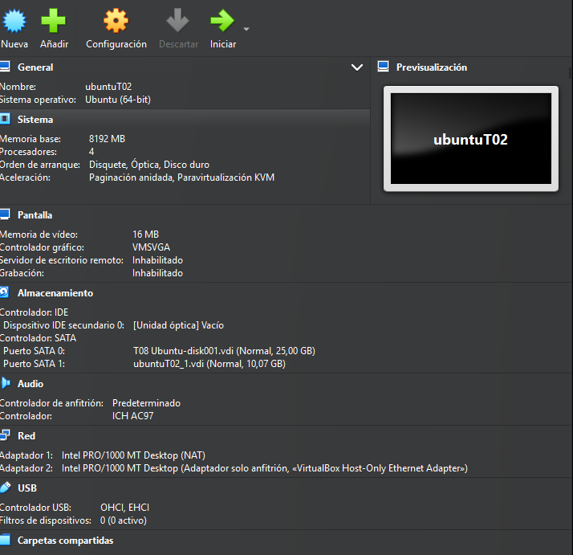

# T02: DPR: còpies de seguretat. Cas pràctic

El primer que farem serà crear dues màquines virtuals, la de Windows i una altra d’Ubuntu, i les configurarem amb aquestes especificacions. En la de Windows crearem dos discs: el del sistema en general i el segon per fer les còpies de seguretat, que serà de 10GB.


## Part 1: Còpia de seguretat dels equips clients Windows

Començarem amb la de Windows, que és la primera que ens demana.

El primer que farem serà anar a Administració de discs, per poder habilitar el segon disc que hem creat, i li donarem a inicialitzar disc.


Posarem tot el disc.


Formatarem el disc amb la configuració predeterminada.


I per últim li donarem a finalitzar i el tindrem habilitat.


Ara el següent pas serà instal·lar Duplicati, que anirem a la seva pàgina web i li donarem a descarregar per a Windows.


En haver finalitzat li donarem a executar.


I ens sortirà això, li haurem de donar a Next.


Acceptarem tot, ho deixarem predeterminat i li donarem a Next.


I li donarem a Finish.


Inicialitzarem i haurem de posar una contrasenya que serà "usuari".


### Creació de backup en el propi equip

Ja comencem creant el backup i li donarem a Add backup.


Després Add new backup.


Ara haurem de posar la configuració general, com el nom, descripció i contrasenya, i li donarem a Continuar.


Haurem d’escollir on volem fer el backup, que serà en el segon disc perquè es guardi allà, i farem Continue. També escollim que farem de My Documents de l’equip.


Escollirem cada quant volem que es faci, que en aquest cas serà cada 1 hora tots els dies.


Aquí deixarem com està predeterminat.


I podrem veure que ja està creat correctament, però ara falta comprovar.


### Comprovació de backup en el propi equip

Crearem una carpeta i podrem posar també unes fotos, en l’apartat de Documents.


Les esborrem totes.


Entrarem una altra vegada en l’aplicació i li donarem a Start.


Veurem el backup que hem fet i li donarem a Restore.


Seleccionarem el que volem recuperar, que serà tot.


I podrem decidir on els recuperarem, però posarem el mateix lloc, que serà en Documents.


I podrem veure que ja ho tindrem ben fet.


### Creació de backup en Google Drive

Farem les mateixes passes que abans i donarem Add backup i New backup.

Després ens sortirà per posar la configuració general i li posarem un altre nom per saber diferenciar.


Però ara en Backup destination posarem Google Drive en vegada de fitxers.


Ens demanaran la Folder path, que posarem Documents, i l’AuthID.


Que això ho aconseguirem automàticament.


Després decidirem a què fer el backup, que serà una altra vegada a Documents.


Posarem que voldrem fer cada dia a les 18:00 el backup.


Deixarem la configuració predeterminada.


I ja tindrem el backup que es guarda en el Google Drive.


Podrem veure en el Drive que està.


### Comprovació de backup en Google Drive

Ara com abans tindrem una carpeta i fotos.


Esborrarem tot.


Li donarem a Inici i a Restore.


I escollirem la de Google Drive i li donarem a Restore.


Una altra vegada seleccionarem el que volem recuperar, que serà tot.


I aquí podem escollir la ruta, però deixarem l’original.


I podrem veure que ja està tot una altra vegada.


## Part 2: Còpia seguretat servidor Linux

Ara continuarem amb el servidor de linux que el configurarem amb un disc secundari de 10GB. I les seguents especificacions. 



Entrarem en la maquina de linux i comprovarem que veu el segon disk. Amb aquesta comanda.

```bash
sudo fdisk -l
``` 

img 55 

Ara crearem una particio nova en el segon disc de 10GB.
Posarem primer N(nova particio), P(Una particio primaria), posarem el que surt per defecte i per ultim W(per guardar.)

```bash
sudo fdisk /dev/sdb
```

img 56

I ara podem veure que s'ha creat correctament. 

```bash
sudo fdisk -l
``` 
img 57

Haurem de posarle en el format XFS amb aquesta comanda.

```bash
sudo mkfs.xfs /dev/sdb1
```

img 58

Creem el punt de muntatge manualment a /media/backup. El primer sera crear la carpeta.

```bash
mkdir /media/backup
```

Lo seguent sera montar. 

```bash
mount /dev/sdb1 /media/backup
```

img 59

Ara ja podrem instalar duplicity.

```bash 
apt install duplicity
```

img 60

Despres podem comprovar que s'ha instalat correctament.

```bash
duplicity --version
``` 

Despres creem dos usuaris adicionals amb carpetas personals. Que seran user2 i user3.

```bash
useradd -m -s /bin/bash user2
useradd -m -s /bin/bash user3
```

img 61

Per comprovar que s'han creat correctament farem.

```bash
grep -E "user2|user3" /etc/passwd
``` 

img 62

Li configurarem la contrasenya amb aquesta comanda.

```bash
passwd user2
passwd user3
```

img 63

Crearem arxius buit sense proposit nomes perqu estiguin alla per poder fer la prova en el carpeta de home del usuari.

```bash 
fallocate -l 10MB archivo1
...
```

img64

El seguent pas sera fer la copia de seguretat de la carpeta /home amb la seguent comanda.

```bash 
sudo duplicity full /home/ file:///media/backup/
``` 

img 65

Despres comprovem que s'ha fet correctament en /media/backup/.

```bash
ls /media/backup
```

img 66

Ara borrarem alguns arxius per poder despres fer el backup.

```bash
rm archivo1
...
```

img 67

El seguent sera fer la restauracio de el /home de usuari ho farem amb.

```bash
duplicity restore file:///media/backup/ /home/usuari
```

img 68

Despres farem un ls i entrarem en el usuari i comprovem que ho tenim tot un altre vegada.

```bash
ls
cd usuari
ls
```

img 69

Despres el seguent pas sera crear un nou fitxer per fer un altre comprovacio.

```bash
fallocate -l 10MB archivo5
``` 

img 70 

Farem una copia nova, i com hem creat un nou arxiu el detectara i fara una copia incremental.

```bash
duplicity full /home/ file:///media/backup/
```

img 71

Ara desmontarem /media/backup.

```bash 
umount /media/backup
```

img 72

Ara crearem un script amb bin-bash que fara la copia completa de /home del usuari principal. Osigui fara tot el que hem fet pero automaticament.

img 73

Despres li donarem permisos de execusio perque sino no podrem executarlo,

```bash
chmod +x fullbackup.sh
```

img 74

I modifiquem el cron perquè s’executi els diumenges a les 23:00. I guardarem.

```bash
crontab -e
```

img 75

img 76

El seguent pas i el ultim sera crear un altre arxiu executable de bin-bash, que sigui el incremental. 

img 77

Donarem tambe els permisos amb chmod.

```bash
chmod +x incrementalbackup.sh
```

img 78

Comprovarem que hem creat els dos am ls -l.

```bash 
ls -l
``` 

img 79

Per ultim el programem a cron perquè s’executi de dilluns a dissabte a les 23:00.

img 80