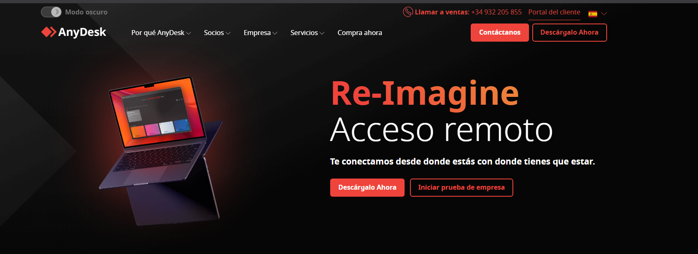
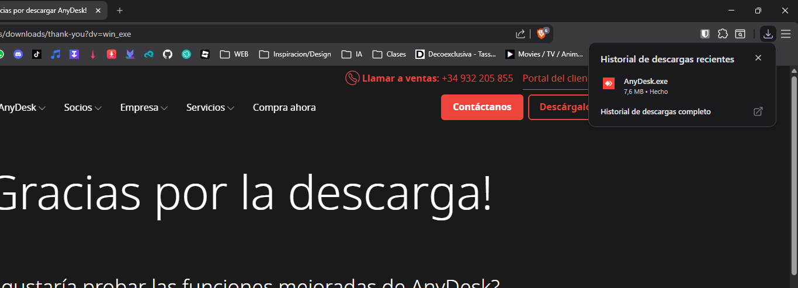
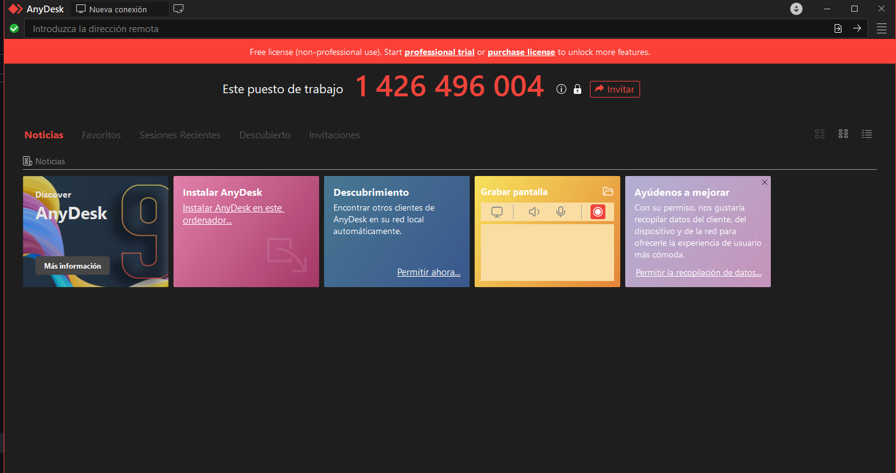
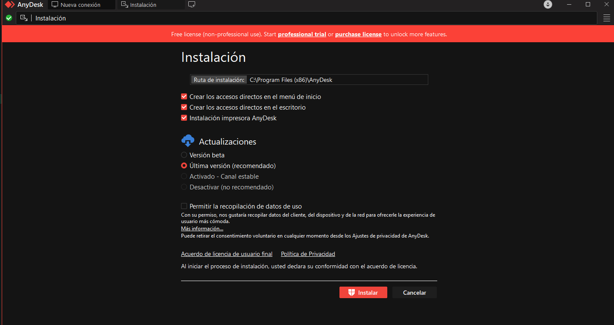
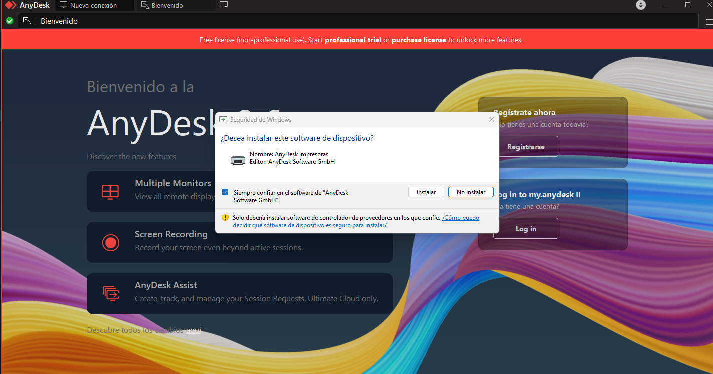
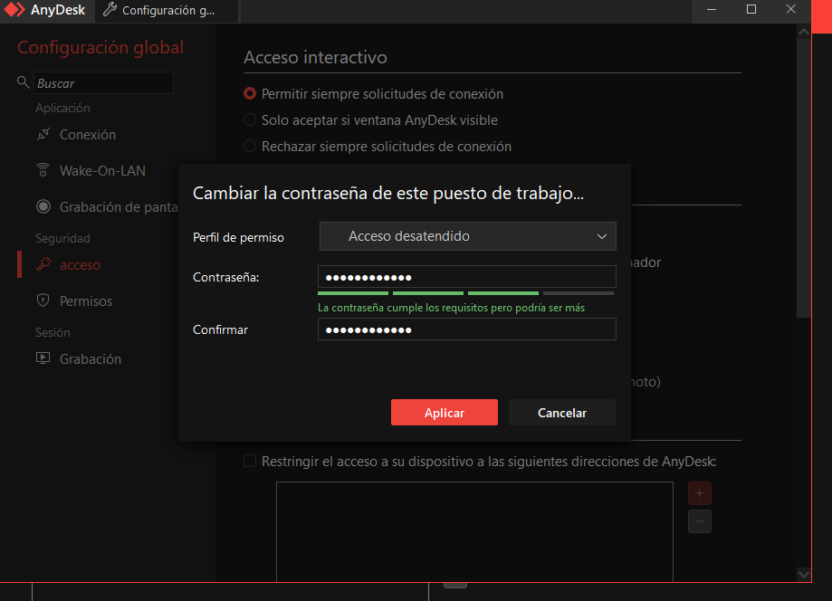
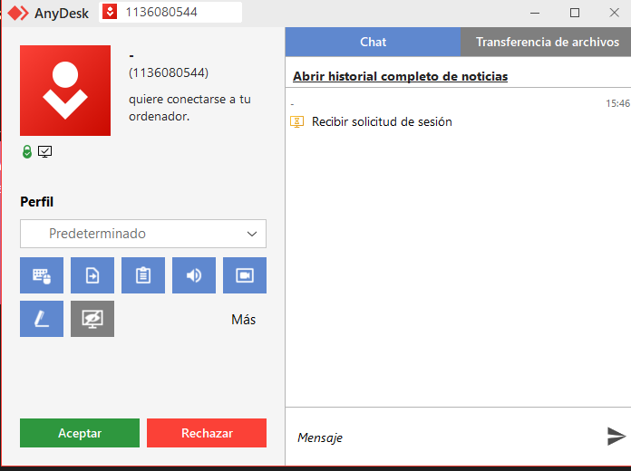

# Guia 2: Manual per al Client (Usuari Final)

## Descargar AnyDesk

Començarem per instal·lar l'eina Anydesk, el primer pas sera buscar Anydesk en google.

Despres li doanrem a descarregar ahora, i ens descareguera un arxiu.exe

L'executarem y ens sortira un menu. Li donarem a descargar en quest ordenador per poder descarrega la versio de escritori.

Despres ens sortira un altre menu amb opcions deixarem les predeterminades i li donarem a instalar i donarem permisos.

Aqui li donarem a  instalar un altre vegada.

Ja tindrem AnyDesk instalat.

## Iniciar sessió de suport

Entrarem en la configuracio de AnyDesk. I posarem una contrasenya nova perque ningu no desitjat no pugui entrar.

I en el menu principal ens sortira el codi

Facilitarem el codi de connexió al tècnic, ja sigui mitjançant una trucada o un missatge. Un cop el tècnic hagi introduït el codi, ens apareixerà una finestra on haurem d’introduir la contrasenya que prèviament hem configurat a AnyDesk (si en disposem) i acceptar la connexió. A continuació, permetrem que el tècnic dugui a terme les accions necessàries per resoldre el problema.

Despres al haver acabat tot podre finalitzar amb el boto vermell.

- [Tornar al enunciat](README.md)
- [Anar activitat 1](activitat1.md)
- [Anar activitat 2](activitat2.md)