# Servidor NFS

El primer que farem serà crear dues màquines virtuals: una serà el servidor NFS, que serà un Ubuntu, i finalment el client, que serà un Zorin OS.

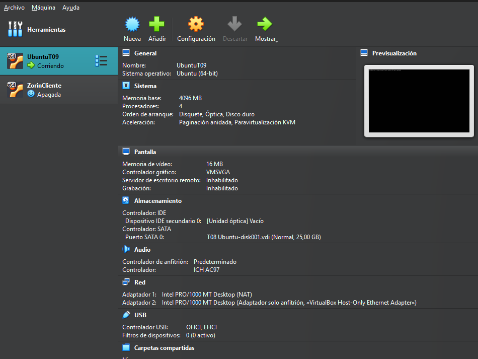


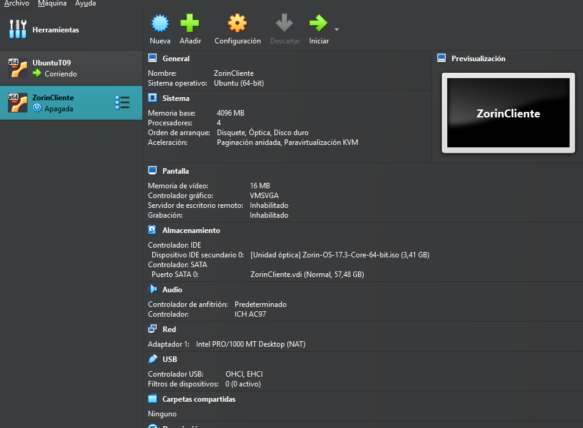


Totes dues hauran de tenir la configuració host-only i s’hauran de poder veure entre elles.

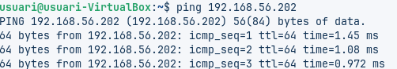


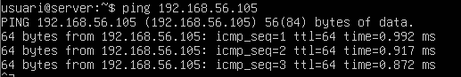


## Preparacio Ubuntu (Servidor) 

Primer entrarem al servidor i ho actualitzarem tot amb apt update && apt upgrade, i crearem dos grups, que seran Devs i Admins. 

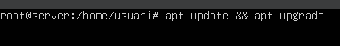


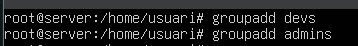


El següent pas serà crear un usuari que es digui devs01 i que sigui membre del grup Devs, i un altre usuari que serà admin01 i formarà part del grup Admins.

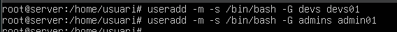

Comprovarem que s’han creat correctament.

```bash
cat /etc/group | grep -E "devs|admins"
``` 

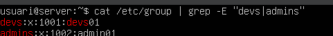

## Creacio de directoris

El que farem serà crear un directori /srv/nfs/dev_projectes. 

```bash
cd /srv
mkdir nfs 
mkdir dev_projectes
```

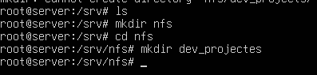

Crearem un altre directori /srv/nfs/admin_tools.

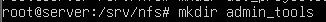

Ara farem que els developers tinguin control sobre el seu directori, cosa que farem amb chown.

```bash
chown :devs dev_projectes/
``` 

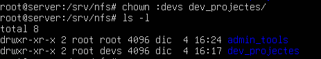

Després farem el mateix, però amb el d’admin.

```bash
chown :admins admin_tools/
```

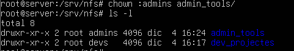

Ara canviem els permisos amb chmod:

```bash
chmod 770 admin_tools/
chmod 770 dev_projectes/
```

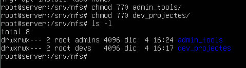

## Preparació Zorin OS (Client)

Ara haurem de fer el mateix amb el client, que serà el Zorin OS.

Però ho farem de manera diferent i més fàcil, gràcies a l’aplicació Users and Groups, que descarregarem des del Software.

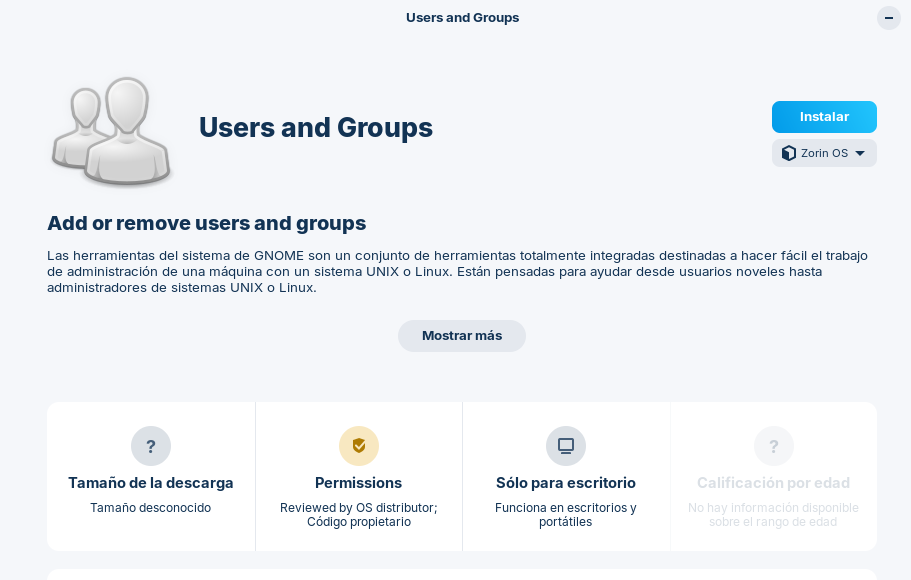

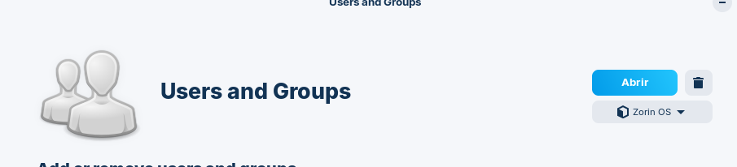

Ara crearem els mateixos usuaris i grups al client Zorin.

El primer serà crear els usuaris devs01 i admin01. Els afegirem amb l’opció “Afegeix” (Add).

Posarem el nom i el usuari.

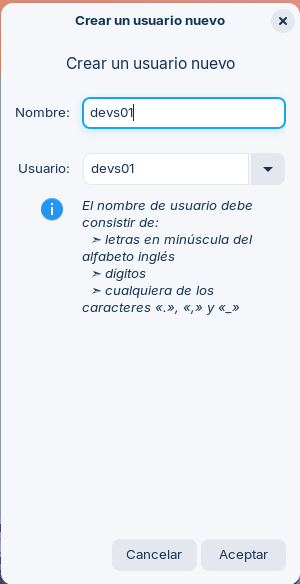

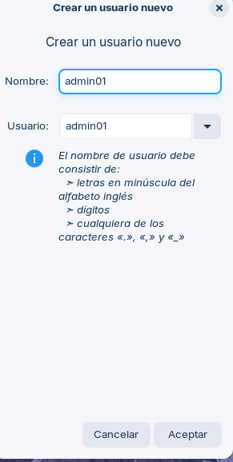

Després configurarem la contrasenya.

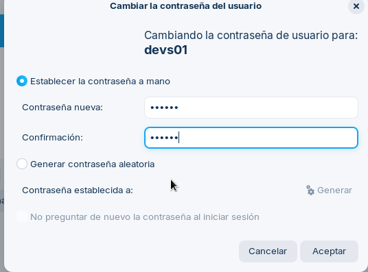

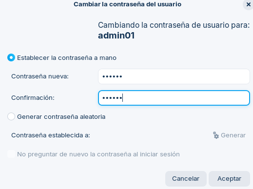

Ara passarem a crear els grups. És molt important que tinguin el mateix GID i UID.

Posarem gestionar grups.


Lo seguent "Añadir".

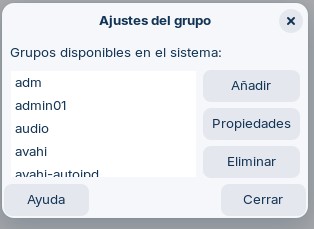

Posarem el nom de devs i despres el ID 1001.

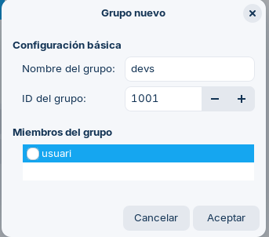

Posarem el nom admins i despres el ID 1002.

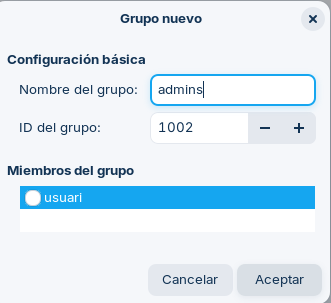

Per últim, posarem els usuaris a cada grup. Anirem a la configuració de grups, seleccionarem Admins i després Devs.

Després farem clic a Propietats.

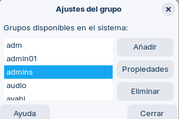

Posarem admins01.

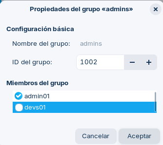

Farem lo mateix amb devs.

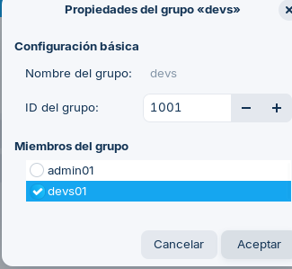

## Instalacio i configuracio de Servidor NFS

Entrarem a l’Ubuntu Server per instal·lar el servidor NFS.

Començarem instal·lant-lo amb les seves dependències:

```bash
sudo apt install nfs-kernel-server -y
```

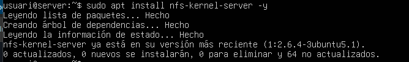

I també comprovarem, amb una altra comanda, que s’ha instal·lat correctament.

```bash
systemctl status nfs-kernel-server
```

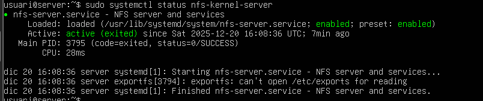

Començarem editant l’arxiu /etc/exports, on decidirem quins directoris exportarem, que només serà el directori /srv/nfs.

```bash 
nano /etc/exports
``` 

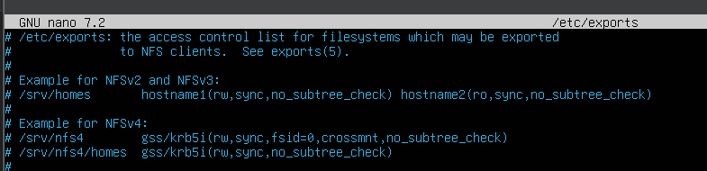

Després afegirem una línia, que serà aquesta:

```bash
/srv/nfs 192.168.56.105(rw,sync)
```

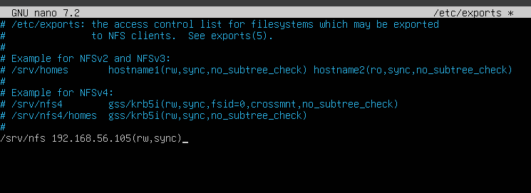

Haurem de reiniciar al servidor

```bash
sudo systemctl restart nfs-kernel-server
```

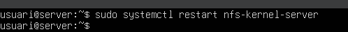

I ara comprovarem que s’està compartint correctament.

```bash 
sudo exportfs -u
``` 

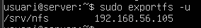 

Ara haurem d’instal·lar i configurar el NFS al client Zorin.

Farem un:

```bash
apt install nfs-commun -y
```

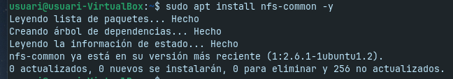

Ara comprovarem que pot veure correctament el directori

```bash
sudo showmount -e 192.168.56.202
```

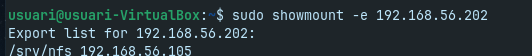

Haurem de crear una carpeta:

```bash
mkdir /srv/remot 
```

Per poder accedir als recursos, haurem de fer un mount per muntar la unitat. Després, per comprovar que s’ha fet correctament, farem un ls.

```bash
sudo mount -t nfs 192.168.56.202:/srv/nfs /srv/remot
ls /srv/remot
```

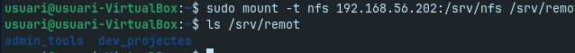

## Fase 3: L'Exportació d'Administració (El Dilema del root_squash)

El client necessita que el directori /srv/nfs/admin_tools sigui accessible per l’equip d’administradors.

Com hem fet abans, editarem l’arxiu /etc/exports i hi afegirem una línia de /srv/nfs/admin_tools 192.168.56.105(rw,sync). 

```bash
/srv/nfs/admin_tools 192.168.56.105(rw,sync)
```

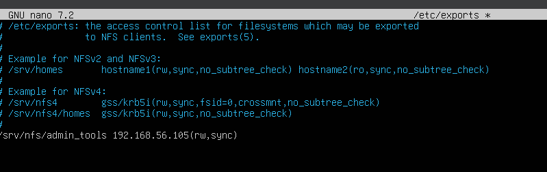

Un cop fet, haurem de reiniciar el servei.

```bash 
sudo systemctl restart nfs-kernel-server
```

Anirem després al client i crearem la carpeta admin_tools.

```bash
sudo mkdir /mnt/admin_tools
``` 

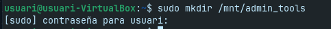

I després, per accedir a tot, muntarem la unitat amb un mount.

```bash
sudo mount -t nfs 192.168.56.202:/srv/nfs/admin_tools /mnt/admin_tools
``` 

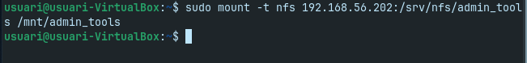

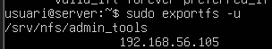

### Prova 1

El fitxer no pertany a root, sinó a l’usuari nobody. Això passa perquè el servidor NFS té activada per defecte l’opció root_squash, que fa que el root del client no tingui privilegis.

Ara mostraré que, com a root, no podrem accedir-hi.

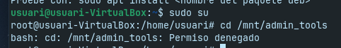

Però si entrem amb l’usuari admin01, sí que podrem, perquè pertany al grup Admins, que és el grup propietari.

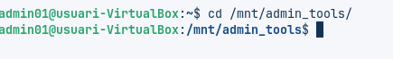

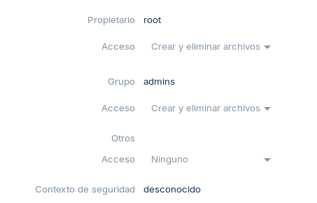

### Prova 2

En afegir l’opció no_root_squash a l’exportació del directori, ara el servidor NFS sí que reconeix el root del client com a root real.

Modificarem una altra vegada l’arxiu /etc/exports, però ara hi afegirem l’opció no_root_squash.

```bash
/srv/nfs/admin_tools 192.168.56.105(rw,sync,no_root_squash)
```

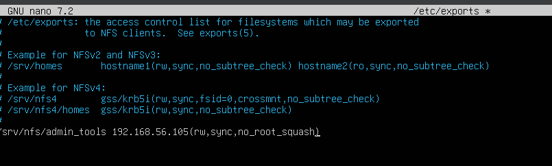

Despres reiniciarem el servei.

```bash
sudo systemctl restart nfs-kernel-server
```

Despres desmontem i muntem l'unitat el client.

```bash
sudo umount /mnt/admin_tools
sudo mount -t nfs 192.168.56.202:/srv/nfs/admin_tools /mnt/admin_tools
```

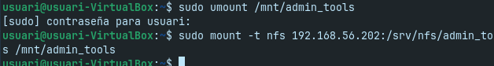

I, per últim, podrem comprovar que podem accedir-hi des de root.

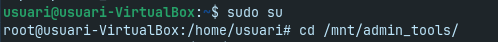

## Fase 4: L'Exportació de Desenvolupament (Permisos rw vs ro)

Ara editarem /etc/exports per afegir dues exportacions per al mateix directori. El client vol que la xarxa d’administració 192.168.56.10/24 hi pugui escriure, però que la xarxa de consultors 192.168.56.150 només pugui llegir.

Afegirem aquestes dues línies a l’arxiu:

```bash
/srv/nfs/dev_projectes 192.168.56.10/24(rw,sync,no_root_squash)
/srv/nfs/dev_projectes 192.168.56.150(ro,sync,no_root_squash)
```

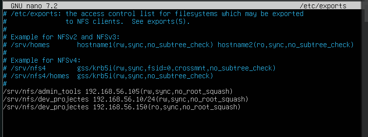

Despres reiniciem el servei.

```bash
sudo systemctl restart nfs-kernel-server
```

El següent pas serà entrar al client i crear la carpeta per poder-la muntar després.

```bash
sudo mkdir /mnt/dev_projectes
``` 

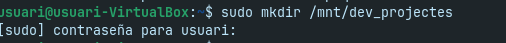

Ara sí, muntarem la unitat per poder accedir als recursos.

```bash
sudo mount -t nfs 192.168.56.202:/srv/nfs/dev_projectes /mnt/dev_projectes
```


### Prova 1

Entrarem al compte de devs01, intentarem crear un arxiu amb aquest compte i veurem que ens ho permet. També comprovarem que té permisos de lectura i escriptura.

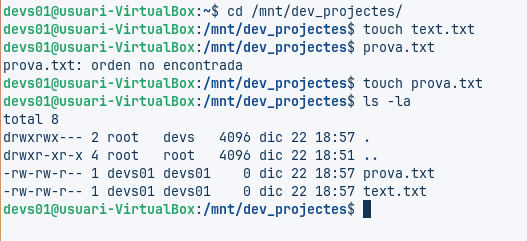

### Prova 2

El següent pas serà canviar la IP del client a la que hem posat abans, que serà 192.168.56.150. Després, desmuntarem i muntarem els recursos, i hauria de funcionar només en mode lectura.

Comencem canviant la IP, que a Zorin OS ho farem des de la configuració de la xarxa.

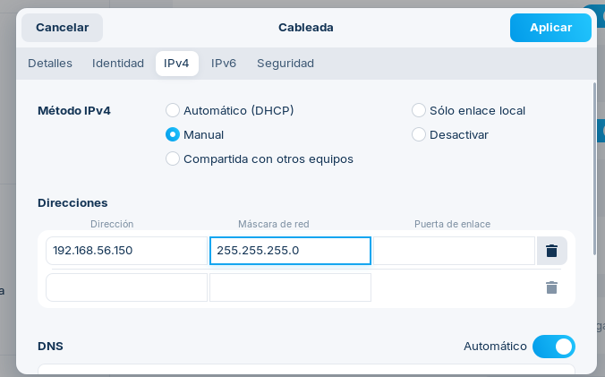

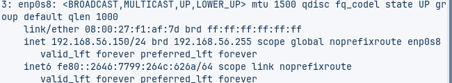

I ara, amb això canviat, desmuntarem i muntarem la unitat.

```bash
sudo umount /mnt/dev_projectes 
sudo mount -t nfs 192.168.56.202:/srv/nfs/dev_projectes /mnt/dev_projectes 
``` 

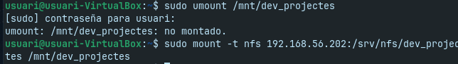

I veurem que, tal com vam posar a l’arxiu /etc/exports, aquesta IP que hem configurat només podrà llegir i no podrà fer res més.


### Prova 3

Ara entrarem amb l’usuari admin01 i veurem que no podrem crear cap fitxer, només llegir.


## Fase 5: Muntatge Automàtic amb /etc/fstab

És evident que els usuaris no poden estar muntant manualment els recursos compartits cada vegada que reinicien el sistema. Per això, es configurarà el muntatge automàtic mitjançant el fitxer /etc/fstab al client.

El primer pas serà editar l’arxiu /etc/fstab.

```bash
sudo nano /etc/fstab
```

Després hi posarem això:

```bash
192.168.56.202:/srv/nfs/admin_tools /mnt/admin_tools nfs defaults 0 0 
192.168.56.202:/srv/nfs/dev_projectes /mnt/dev_projectes nfs defaults 0 0 
```


Després fem aquesta comanda per provar les entrades sense reiniciar:

```bash
sudo mount -a
```

Reiniciarem i comprovarem que s’ha fet correctament.


## Conclusió

Aquesta es una eina normal la veritat, tot el proces si s'ha de fer en molt ordinadors crec que podria tardar una mica molt de temps i no seria tan eficaz i aver de pasar a cada ordinador per configurarlo crec que menjaria molt de temps.

Tambe es recomana implementar un sistema d’autenticació centralitzada (com LDAP, FreeIPA) per evitar el error de no tenir els mateixos valors en UID i GID entre equips. 

Tambe es podria evolucioanr a NFSv4 que ofereix millor seguretat i suport per a autenticació forta amb Kerberos

- [Tornar al enunciat](README.md)